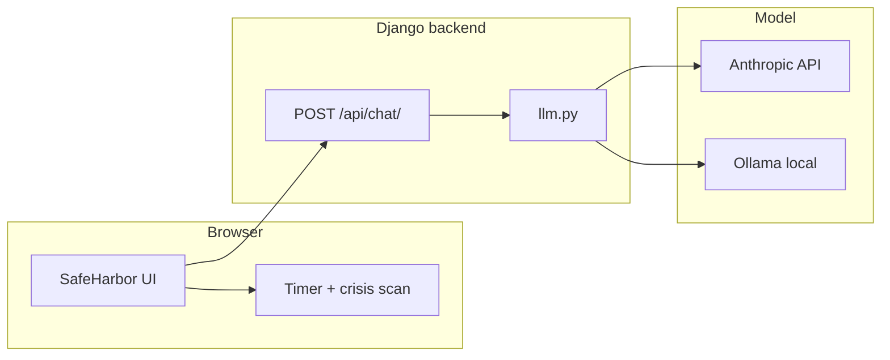

# SafeHarbor

AI gambling addiction consulting agent: motivational counseling, country-specific legal guidance (six countries), proactive check-ins after 60 seconds of silence, and keyword-based crisis detection with instant helpline surfacing.

**Stack:** Next.js (frontend), **Django** (Python backend API), React, Tailwind CSS, and either **Anthropic Claude** or a **local Ollama** model (`backend/chat/llm.py`).

## Architecture



1. **Onboarding** collects first name and country (Sweden / UK / US / Australia / Germany / Ireland / Other).
2. **System prompt** is built in the browser and sent with each request; Django forwards `system` + `messages` to the configured LLM.
3. **Crisis detection** runs in the browser; helplines are shown in a banner when keywords match.
4. **Proactive check-in** after 60s silence: the UI requests a short reply (probe is not stored in the visible thread).
5. **API keys** for Anthropic live only in `backend/.env` when using Claude. Ollama needs no cloud key.

### Your own model (local, open weights)

Training a neural network from scratch is not what this repo does. Practical options:

| Approach | What it means |
|----------|----------------|
| **Ollama** (built in) | Run Llama, Mistral, etc. on your machine. Set `LLM_PROVIDER=ollama`, `OLLAMA_MODEL=...` in `backend/.env`. Install [Ollama](https://ollama.com), then e.g. `ollama pull llama3.2`. |
| **Custom Ollama tag** | Copy `backend/ollama/Modelfile.example` → `Modelfile`, edit it, run `ollama create safeharbor -f Modelfile`, set `OLLAMA_MODEL=safeharbor`. |
| **Fine-tuning** | Train or LoRA-tune an open model elsewhere, then serve it with Ollama or another server and point `OLLAMA_BASE_URL` / model name at it. |

### Backend location

Python Django project: **`backend/`**

- `backend/config/` — Django settings, root URLconf
- `backend/chat/views.py` — `chat` view: validates JSON, calls `complete()` in `llm.py`
- `backend/chat/llm.py` — Anthropic or Ollama backend
- `backend/manage.py` — `runserver`, etc.

## Setup

**1. Django (terminal1)**

```bash
cd backend
python3 -m venv .venv
source .venv/bin/activate   # Windows: .venv\Scripts\activate
pip install -r requirements.txt
cp .env.example .env
# For Claude: set ANTHROPIC_API_KEY. For local Ollama: LLM_PROVIDER=ollama and OLLAMA_MODEL=llama3.2
python manage.py runserver 0.0.0.0:8000
```

**2. Next.js (terminal 2)**

```bash
npm install
cp .env.example .env
# Ensure NEXT_PUBLIC_DJANGO_API_URL=http://127.0.0.1:8000
npm run dev
```

Open [http://localhost:3000](http://localhost:3000).

For production, deploy Django (e.g. Railway, Fly.io, your VPS) and set `NEXT_PUBLIC_DJANGO_API_URL` to that public origin. Add that origin to `CORS_ALLOWED_ORIGINS` and `CSRF_TRUSTED_ORIGINS` on the server.

## Deploy (Vercel + Django)

- **Frontend (Vercel):** set `NEXT_PUBLIC_DJANGO_API_URL` to your deployed Django base URL.
- **Backend:** set `ANTHROPIC_API_KEY`, `DJANGO_SECRET_KEY`, `DJANGO_DEBUG=0`, `DJANGO_ALLOWED_HOSTS`, and CORS/CSRF origins for your Vercel domain.

## Resume bullet

Built SafeHarbor, an AI gambling addiction consulting agent using the Claude API, a **Django** backend, and React — combines motivational counseling, country-specific legal guidance across six countries, proactive check-ins, and real-time crisis detection.


