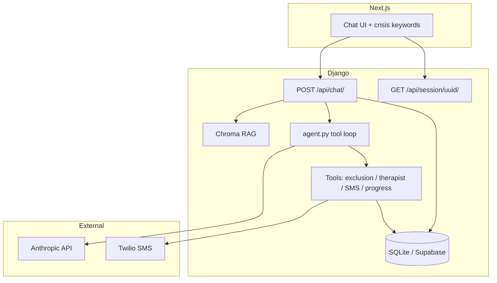

# SafeHarbor

Agentic gambling-addiction support: **persistent memory** (Postgres/Supabase or SQLite), **Anthropic tool calling** (self-exclusion lookup, therapist search URLs, Twilio SMS, progress logging), **RAG** over curated EU/UK legal excerpts (Chroma), **in-chat proactive nudges** (60s silence), and a **cron-friendly** command for daily SMS check-ins after 24h idle.

**Stack:** Next.js, Django, SQLite or **Supabase Postgres**, **Chroma** (local vector store), **Anthropic Claude** (agent loop) or **Ollama**, optional **Twilio**.

## Architecture



| Layer | Behavior |
|-------|----------|
| **Memory** | `ChatSession` (UUID in `localStorage`), `ChatMessage` transcript, `UserProgress` (days clean + summary from `record_progress` tool). |
| **Agent** | Anthropic Messages API with `tool_use` loop (`backend/chat/agent.py`); Ollama path uses plain completion (`AGENT_TOOLS` ignored). |
| **Tools** | Curated self-exclusion metadata (official URLs; no private operator APIs), Psychology Today–style search URLs, Twilio SMS (optional), DB progress. |
| **RAG** | `python manage.py ingest_legal_docs` chunks `backend/legal_docs/*.md` into Chroma; last user message retrieves context into the system prompt. |
| **Scheduler** | `python manage.py check_in_nudges` — SMS users inactive 24h+ if `phone_e164` + Twilio env set. Run daily via **cron**, **GitHub Actions**, or **Celery** later. |

### Backend layout

- `backend/chat/models.py` — `ChatSession`, `ChatMessage`, `UserProgress`
- `backend/chat/views.py` — chat + session restore
- `backend/chat/agent.py` — tool loop (Anthropic)
- `backend/chat/tools.py` — tool implementations + schemas
- `backend/chat/rag.py` — Chroma retrieval
- `backend/chat/management/commands/ingest_legal_docs.py` — RAG ingest
- `backend/chat/management/commands/check_in_nudges.py` — proactive SMS

## Setup

**1. Backend**

```bash
cd backend
python3 -m venv .venv
source .venv/bin/activate
pip install -r requirements.txt
cp .env.example .env
# Set ANTHROPIC_API_KEY for Claude agent. Optional: DATABASE_URL (Supabase), Twilio.
python manage.py migrate
python manage.py ingest_legal_docs   # requires chromadb; builds vector index
python manage.py runserver 0.0.0.0:8000
```

**2. Frontend**

```bash
npm install
cp .env.example .env
# NEXT_PUBLIC_DJANGO_API_URL=http://127.0.0.1:8000
npm run dev
```

**3. Daily nudges (optional)**

```bash
# Cron example: 9am daily
# 0 9 * * * cd /path/to/backend && .venv/bin/python manage.py check_in_nudges
```

## Deploy

- **Vercel:** frontend + `NEXT_PUBLIC_DJANGO_API_URL` to your API host.
- **Django host:** `DATABASE_URL`, `ANTHROPIC_API_KEY`, `DJANGO_SECRET_KEY`, `DJANGO_DEBUG=0`, CORS/CSRF, Twilio if using SMS, persistent volume or S3 for `.chroma_data` if you ingest on deploy.

## Resume bullet

Built **SafeHarbor** — an agentic gambling-addiction consultant with **persistent session memory** (Django + Supabase-ready Postgres), **Claude tool calling** (self-exclusion registry lookup, therapist directory URLs, optional **Twilio** SMS, progress logging), **RAG** over EU/UK legal excerpts in **Chroma**, and a **proactive daily check-in** command for inactive users — **Next.js**, **Django**, **Anthropic**, **Chroma**.

## Disclaimer

SafeHarbor is a supportive tool, not a substitute for licensed medical or legal advice or emergency services. Tool output and RAG excerpts are educational; verify with official sources and professionals.
